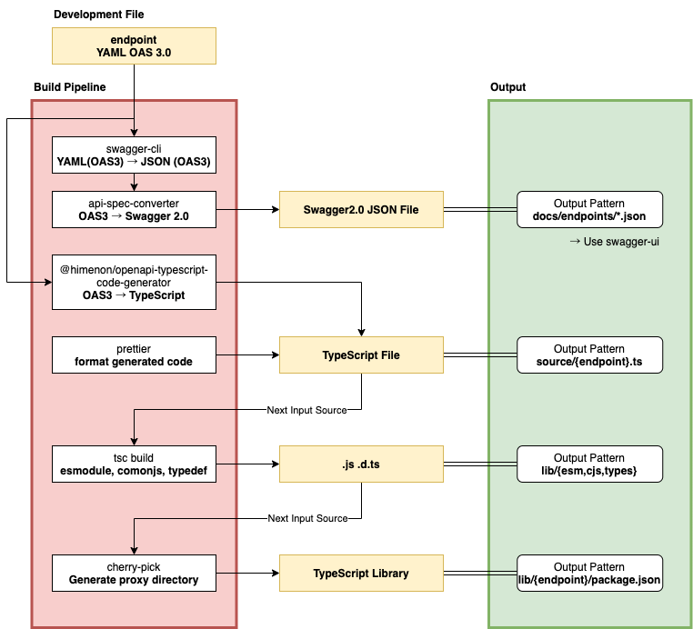

# @himenon/openapi-typescript-practice

- [ドキュメント - https://himenon.github.io/openapi-typescript-practice](https://himenon.github.io/openapi-typescript-practice)

## Development

| scripts         | description                                                                      |
| :-------------- | :------------------------------------------------------------------------------- |
| build           | build:code, build:docs を順次実行                                                |
| build:code      | TypeScript のコードを生成                                                        |
| build:docs      | ドキュメントを生成                                                               |
| clean           | build 関連のファイル・ディレクトリを削除                                         |
| json2schema     | json から OpenApi 3.0 の schema を吐き出す。巨大な json などに利用すると良い     |
| mock:server     | `yarn run mock:server localhost`と実行することで API Mock Server を起動 |
| publish:ghpages | docs を ghpages に publish                                                       |
| ts              | ts-node を実行する                                                               |

## Build Pipeline

### yarn build:code



### Release

release version

```bash
yarn run lerna version --yes
```

## Tools

- https://marketplace.visualstudio.com/items?itemName=philosowaffle.openapi-designer
- https://hub.docker.com/r/swaggerapi/swagger-ui/
- https://www.npmjs.com/package/@stoplight/prism-cli
- https://github.com/stoplightio/prism

## Reference

- [VSCode でリファクタリング・保守する OpenAPI - Qiita](https://qiita.com/tMinami/items/5b1a921e82b4c7979cd1)
- [俺的【OAS】との向き合い方 (爆速で OpenAPI と友達になろう)](https://tech-blog.optim.co.jp/entry/2020/04/13/100000)

## LICENSE

MIT
